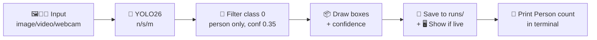

# 🧍‍♂️📸 Person-Detection-AI — Real-Time Person Detection with YOLO26 🤖✨

> ⚡ Detect **people** in 🖼️ images, 🎥 videos & 🔴 live webcam using pretrained **Ultralytics YOLO26** — with ⚙️ automatic GPU/CPU switching, 💾 auto-saved outputs & 🎯 person-only filtering!


---

## 🌟 Hey Judges! Why You'll Love This Project 💖

| ✨ Feature | 📝 What It Does |
|-----------|-----------------|
| 🧠 **YOLO26 Powered** | Uses latest Ultralytics YOLO26 (`n` / `s` / `m`) pretrained on COCO — **no training needed!** |
| 🎯 **Person-Only Mode** | Filters `COCO class 0 = person`, ignores cars, dogs, chairs 🙅‍♂️🚗🐕 |
| 🎥 **3-in-1 Input** | 🖼️ Image + 🎞️ Video file + 🔴 Live webcam (`0`) — all in ONE script! |
| ⚡ **Auto GPU/CPU** | Uses `cuda:0` if available, else falls back to `cpu` 🖥️➡️🚀 |
| 💾 **Auto-Save** | Annotated results saved to `runs/detect/predict*/` automatically 📁 |
| 📊 **Confidence Scores** | Prints `Person 1: confidence 0.87` for every detection 🔢 |
| 🪟 **1-Click Windows Run** | Double-click `run_person_detection.bat` — done! 🖱️ |
| 👨‍💻 **VS Code Ready** | 3 debug configs: demo image, webcam, your file ▶️ |

---

## 🧠🤖 Model Details — Figured Out For You! 🔍

You didn't remember? No worries — I reverse-engineered everything from your code! 🕵️‍♂️👇

### 🏗️ Architecture

- **Model Family:** Ultralytics **YOLO26** (successor to YOLOv8 / YOLO11) 🆕
- **Type:** Single-stage object detector — `backbone + neck + head` 🏛️
- **Pretrained On:** **COCO dataset** (330K images, 80 classes) 📚
- **Task:** `detect` — bounding boxes + confidence 📦
- **Class Used:** `0 = person` only (filtered via `classes=[0]`) 🧍
- **Confidence Threshold:** `conf=0.35` — balanced precision/recall ⚖️
- **Device Logic:** `cuda:0 if torch.cuda.is_available() else cpu` 🎮
- **Inference API:** `ultralytics.YOLO.predict(save=True, show=is_live)` 🛠️

### 📦 Included Weights

| 🎯 Model | 📄 File | 💾 Size | 🚀 Speed | 🎯 Accuracy | 💡 Best For |
|---------|---------|---------|----------|-------------|-------------|
| ⚡ **Nano** | `yolo26n.pt` | ~5.5 MB | 🟢 Fastest | ⭐⭐⭐ | 💻 Laptops, CPU, real-time webcam |
| ⭐ **Small (default)** | `yolo26s.pt` | ~20.4 MB | 🟡 Fast | ⭐⭐⭐⭐ | ✅ Best balance — **recommended!** |
| 🧠 **Medium** | `yolo26m.pt` | ~44.2 MB | 🟠 Slower | ⭐⭐⭐⭐⭐ | 🎯 Crowds, far/small people |

> 💡 All 3 `.pt` files are already in this repo so judges can run **offline** without downloading! 🔌❌

### 🔄 How It Works (Pipeline)



1. 📥 Load `yolo26*.pt` via `ultralytics.YOLO` 
2. 🖥️ Pick device — GPU if `torch.cuda.is_available()` else CPU
3. 🔍 Run `model.predict(source, classes=[0], conf=0.35)`
4. 🖼️ Annotate frames + 💾 save to `runs/detect/predict*/`
5. 🖥️ If video/webcam → `show=True` popup window (press **Q** to quit 👋)
6. 🔢 Print `Persons in frame: N` + per-person confidence

---

## 📁 Project Structure 🗂️

```
Person-Detection-AI/
├── 🐍 detect_person.py            # <-- MAIN script, all logic here!
├── 🪟 run_person_detection.bat    # <-- 1-click Windows launcher
├── ⚡ yolo26n.pt                  # Nano weights (5.5 MB)
├── ⭐ yolo26s.pt                  # Small weights (20.4 MB, DEFAULT)
├── 🧠 yolo26m.pt                  # Medium weights (44.2 MB)
├── 🖼️ bus.jpg                     # Demo image (Ultralytics bus 🚌)
├── 📋 requirements.txt            # All dependencies
├── 🚫 .gitignore                  # Ignores venv/, runs/, cache
├── 📖 README.md                   # You are here! 👋
├── ⚙️ .vscode/
│   ├── launch.json                # 3 debug configs ▶️
│   └── settings.json              # Default interpreter 🐍
└── 📁 runs/detect/predict*/       # Auto-generated outputs (git-ignored)
```

**Core script:** `detect_person.py` — only **55 lines**! 📏✨

| Function | Does |
|----------|------|
| `detect(source, model_key='s')` | Loads model, picks device, runs prediction, prints + saves |
| `__main__` | Parses CLI: `python detect_person.py <source> [n/s/m]`, `0` = webcam 🔴 |

---

## 🚀💻 Installation Guide — Step By Step For ANY Laptop! 🙋‍♂️🙋‍♀️

### ✅ Prerequisites

- 🐍 **Python 3.10 or 3.11** (you used `3.11.15` — perfect!) — [Download here](https://www.python.org/downloads/)
- 🖥️ **Windows / Mac / Linux** — all supported! 🪟🍎🐧
- 🎮 **GPU (optional):** NVIDIA + CUDA for speed. CPU works too! 🐢➡️🚀
- 📷 **Webcam (optional):** only for live mode 🔴
- 🧰 **Git** — [Download here](https://git-scm.com/downloads)

### 🪟 Option A: Windows (Easiest — Recommended! ⭐)

```powershell
# 1️⃣ Clone the repo
git clone https://github.com/mehtadevansh736-a11y/Person-Detection-AI.git
cd Person-Detection-AI

# 2️⃣ Create virtual environment
python -m venv venv
.\venv\Scripts\activate

# 3️⃣ Install dependencies
pip install --upgrade pip
pip install -r requirements.txt

# 4️⃣ Run demo! 🎉
python detect_person.py bus.jpg s
```

> 🖱️ **Even easier:** just double-click `run_person_detection.bat` after installing deps!
> ```
> run_person_detection.bat bus.jpg s
> run_person_detection.bat 0 s
> ```

### 🍎🐧 Option B: Mac / Linux

```bash
# 1️⃣ Clone
git clone https://github.com/mehtadevansh736-a11y/Person-Detection-AI.git
cd Person-Detection-AI

# 2️⃣ Venv
python3 -m venv venv
source venv/bin/activate

# 3️⃣ Install
pip install --upgrade pip
pip install -r requirements.txt

# 4️⃣ Run 🎉
python detect_person.py bus.jpg s
```

### 🎮 Option C: GPU Support (NVIDIA — Faster! ⚡)

CPU install already includes PyTorch CPU. For **CUDA GPU**:

```powershell
# After pip install -r requirements.txt, upgrade torch to CUDA build:
pip install torch torchvision --index-url https://download.pytorch.org/whl/cu130
python -c "import torch; print(torch.cuda.is_available())"  # Should print True ✅
```

> 🧪 **Tested on:** `torch 2.13.0+cu130`, CUDA 13.0, `ultralytics 8.4.126` ✅

---

## 🎮 How To Run / Use 🕹️

### 🖼️ 1. Detect in an Image

```powershell
python detect_person.py bus.jpg s
python detect_person.py C:\Photos\crowd.jpg m   # use medium for crowds 🧠
python detect_person.py https://ultralytics.com/images/bus.jpg  # URL also works! 🌐
```

### 🎞️ 2. Detect in a Video

```powershell
python detect_person.py myvideo.mp4 s
# 👉 Popup window plays annotated video, press Q to quit 👋
# 💾 Saved to: runs/detect/predict*/myvideo.avi
```

### 🔴 3. Live Webcam Detection

```powershell
python detect_person.py 0 s        # 0 = default webcam 📷
python detect_person.py 0 n        # nano = fastest for old laptops ⚡
# 👉 Live window opens, press Q to quit 👋
```

### 🧠 4. Switch Models

| Command | Meaning |
|---------|---------|
| `python detect_person.py bus.jpg n` | ⚡ Nano — fastest, lowest accuracy |
| `python detect_person.py bus.jpg s` | ⭐ Small — **default**, best balance |
| `python detect_person.py bus.jpg m` | 🧠 Medium — slowest, highest accuracy |

### 🪟 5. Windows 1-Click `.bat` Launcher

```bat
run_person_detection.bat bus.jpg s
run_person_detection.bat 0 s
run_person_detection.bat myvideo.mp4 m
```

### 👨‍💻 6. VS Code Debugging ▶️

Press `F5` and pick:
- 🖼️ **Person Detection (demo image)** — runs on default bus image
- 🔴 **Person Detection (webcam)** — runs `detect_person.py 0`
- 📄 **Person Detection (your file)** — open any image/video, then run!

---

## 📊 Sample Output 🎉

```text
Model: yolo26s.pt | Device: cuda:0 (NVIDIA GeForce RTX 4060)
Persons in frame: 3
  Person 1: confidence 0.92
  Person 2: confidence 0.88
  Person 3: confidence 0.71

Annotated output saved to: runs/detect/predict3
```

📁 **Outputs go to:** `runs/detect/predict/`, `predict2/`, `predict3/`... (auto-incremented, git-ignored) 💾

---

## 📋 Dependencies / Requirements 🧰

**Tested environment (yours!):**

| 📦 Package | 📌 Version Tested | 💡 Purpose |
|-----------|-------------------|------------|
| 🐍 python | `3.11.15` | Runtime |
| 🤖 ultralytics | `8.4.126` | YOLO26 model + inference |
| 🔥 torch | `2.13.0+cu130` | Deep learning backend + CUDA |
| 👁️ torchvision | `0.28.0+cu130` | Vision utils |
| 📷 opencv-python | `5.0.0.93` | Video/webcam + display |
| 🔢 numpy | `2.4.6` | Arrays |
| 🖼️ pillow | `12.3.0` | Image I/O |
| 📊 matplotlib | `3.11.1` | Plotting (ultralytics dep) |
| 📄 pyyaml | `6.0.3` | Config parsing |

Full list → see `requirements.txt` 📋

Install all at once: `pip install -r requirements.txt` ✨

---

## 🛠️ Troubleshooting — Don't Panic! 🆘

| 😱 Problem | ✅ Fix |
|-----------|--------|
| `torch.cuda.is_available() = False` | Normal on CPU laptops! Code auto-falls back to CPU 🐢. For GPU: install CUDA torch (see Option C above) 🎮 |
| 📷 Webcam won't open / black screen | Close Zoom/Teams/Chrome using camera ❌📹, try `1` instead of `0`, check privacy: Settings → Camera ✅ |
| 🐌 Too slow / laggy | Use `n` model: `python detect_person.py 0 n` ⚡, or lower camera resolution |
| ❌ `yolo26s.pt not found` | Run from project root: `cd Person-Detection-AI` 📁, don't move the script away from `.pt` files! |
| 📦 `ModuleNotFoundError: ultralytics` | Activate venv first: `.\venv\Scripts\activate` then `pip install -r requirements.txt` 🐍 |
| 🪟 Popup window won't close | Press **Q** (not X) in the video window ⌨️ |
| 🍎 Mac `cv2.imshow` error | Install: `brew install opencv`, or just use image mode (no `show`) 🖼️ |

---

## 🔮 Future Scope / Ideas 💡🚀

- 🧮 **People counter + crowd alerts** (e.g. beep if > 10 people) 🔔
- 📍 **Zone detection** — count only inside a drawn ROI 🟩
- 🎭 **Face blur** for privacy 😶‍🌫️
- 🌐 **Streamlit web demo** — upload image, see boxes in browser 🖥️
- 📱 **Mobile export** (YOLO26 → ONNX / TensorRT / CoreML) 📲
- 🌙 **Thermal/night mode** — see author's separate `thermal_human_model` repo! 🌡️ (coming soon 👀)
- 📊 **Analytics dashboard** — entries/exits per hour 📈

---

## 🙏 Acknowledgements 💖

- 🧠 [Ultralytics](https://github.com/ultralytics/ultralytics) for YOLO26 + COCO pretrained weights
- 🔥 [PyTorch](https://pytorch.org/) for deep learning backend
- 📷 [OpenCV](https://opencv.org/) for video handling
- 🖼️ Demo image `bus.jpg` © Ultralytics

---

## 📜 License 📄

MIT License — free to use, modify & share! 🎉 See `LICENSE` file.

---

## 👨‍💻 Author ✍️

**Devansh Mehta** — [@mehtadevansh736-a11y](https://github.com/mehtadevansh736-a11y) 🌟

> ⭐ **If you liked this project, please give it a star!** ⭐  
> 🍴 Fork it, 💡 improve it, 🎤 present it with confidence! Good luck, judges love live webcam demos! 🔴📷✨
